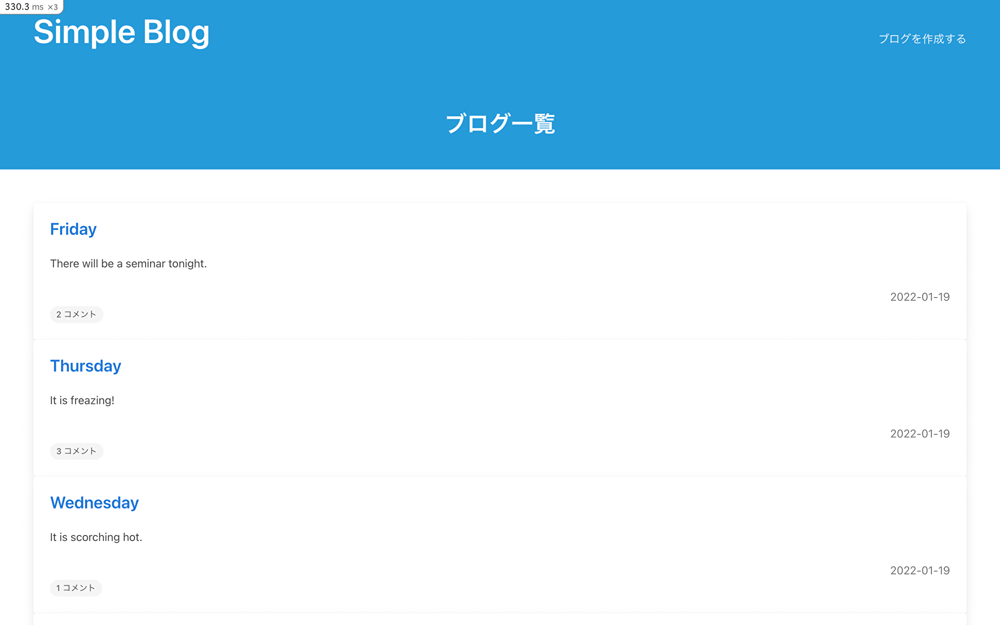

![app-shield]
![purpose-shield]
![title-shield]

# Name

## Simple Blog

Anyone can freely post a blog and make a comment on blogs posted by others.

- [Simple Blog][project-url]

# Description

This is a basic blog with comments built with Ruby on Rails. Each blog post will be able to be created, read, edited/updated, and deleted. There will also be comments that come with each blog post, which will be able to be created and deleted. No user registration required.

# Demo

- https://blog-ndph4.ondigitalocean.app/

# Requirement

- Ruby 3.1.4
- Rails 6.1.4.4
- PostgreSQL 14.9
- HTML 5.1
- CSS (Bulma - CSS framework)

# Gems used

- [BetterErrors/better_errors: Better error page for Rack apps](https://github.com/BetterErrors/better_errors)
- [joshuajansen/bulma\-rails](https://github.com/joshuajansen/bulma-rails)
- [heartcombo/simple_form: Forms made easy for Rails\! It's tied to a simple DSL, with no opinion on markup\.](https://github.com/heartcombo/simple_form)
- [guard/guard: Guard is a command line tool to easily handle events on file system modifications\.](https://github.com/guard/guard)
- [guard/guard\-livereload: Guard::LiveReload automatically reload your browser when 'view' files are modified\.](https://github.com/guard/guard-livereload)
- [deivid\-rodriguez/pry\-byebug: Step\-by\-step debugging and stack navigation in Pry](https://github.com/deivid-rodriguez/pry-byebug)

# ER Diagram

<!--MARKDOWN LINKS & IMAGES -->

[app-shield]: https://img.shields.io/badge/APP-1%20%2F%2020-orange
[title-shield]: https://img.shields.io/badge/PROJECT%20TITLE-Blog-green
[purpose-shield]: https://img.shields.io/badge/PURPOSE-Coding%20Challenge%20Websites-blue
[project-url]: https://blog-ndph4.ondigitalocean.app/
